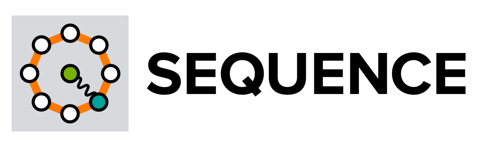

Welcome to the SeQUeNCe documentation page
==========================================

==========================================

.. toctree::
    :maxdepth: 1
    :caption: Tutorials:

    tutorial/chapter0/prerequisite
    tutorial/chapter1/discrete-event-simulation
    tutorial/chapter2/hardware
    tutorial/chapter3/entangle
    tutorial/chapter4/resource_management
    tutorial/chapter5/network_manager
    tutorial/chapter6/application

.. toctree::
    :maxdepth: 1
    :caption: Module References:

    references/application/top
    references/components/top
    references/entanglement_management/top
    references/kernel/top
    references/misc/top
    references/network_management/top
    references/qkd/top
    references/resource_management/top
    references/topology/top

.. toctree::
    :maxdepth: 1
    :caption: Parallel Simulation Pages:

    parallel/install/prerequisite
    parallel/explanation/parallel_tl_qm
    parallel/guide/running_script

.. toctree::
    :maxdepth: 1
    :caption: Parallel Module References:

    references/parallel/top

Indices and tables
==================

* :ref:`genindex`
* :ref:`modindex`
* :ref:`search`
