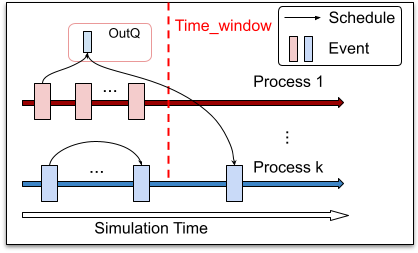
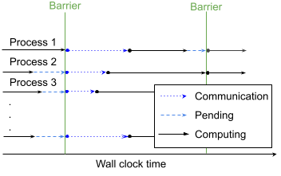
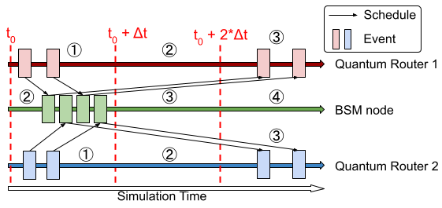
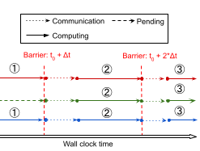
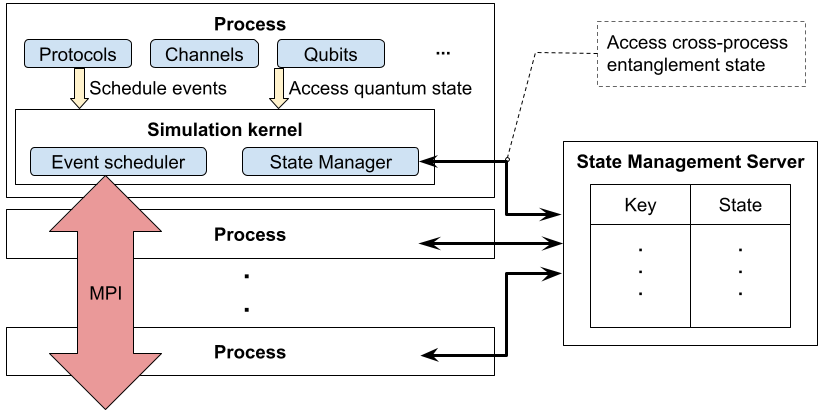

# Explanation: Parallel Timelines and the Quantum Manager

Just like sequential simulation, parallel simulation in SeQUeNCe utilizes timelines to track and execute events on entities.
However, entities on one process may schedule events for entities on another process, and the entangled nature of quantum states requires that multiple processes may need to access and modify the properties of shared quantum systems.
SeQUeNCe thus requires a method for communicating events between these timelines and synchronizing quantum states.

## Conservative Synchronization

For discrete event simulation of networks, conservative synchronization is an algorithm to ensure that all events on a process are executed in the correct order (even if scheduled by another process).
The main tool of conservative synchronization is the synchronization window, during which events are exchanged between processes.

Outside a synchronization window, processes are free to execute events without fear of out-of-order execution up to a lookahead time.
This time is determined by the delay in network links between processes.
Since there is a non-zero time for messages to transfer between network nodes, all messages received from a separate process will not be scheduled until after the lookahead time; synchronization may thus be performed at this point.
For quantum networks, qubits are treated in the same way as messages, with the delay determined by the speed of photon transmission in optical fibers.

A diagram showing the execution of events with conservative synchronization is shown below with respect to simulation time:

And, with respect to wall clock time, is shown here:

### Asynchronous Timeline
A common scheme for building entanglement distribution networks is meet-in-the-middle, where two router nodes are linked to a middle Bell state measurement (BSM) node to generate entanglement.
Since quantum router nodes must wait for BSM results from the middle node before continuing to distribute entanglement, they may treat the connecting network edge as having a delay equal to the classical delay from the BSM node.
For such networks, it is thus possible to increase lookahead time (and thus reduce synchronization overhead) by having BSM nodes on a separate timeline (or timelines) that operates asynchronously from the router nodes (executing events in a separate time window).

With this modification, the lookahead time dT is set to T_cc / 2, where T_cc is the classical channel delay between BSM nodes and adjacent routers.
The BSM timeline additionally operates one time window behind the router nodes.
In this way, the BSM timeline is behind the router timeline by at most dT * 2 = T_cc, which ensures classical messages from the BSM nodes are scheduled to be received at the router nodes beyond the current time window.
An illustration of this process with respect to simulation time is shown below:

And with respect to wall clock time is shown here:

Asynchronous timelines are implemented on the `async_tl` branch.

## Quantum Manager
For quantum states that are unentangled or distributed within a single process, a single quantum manager is sufficient for storage and manipulation.
Once these states cross a process boundary, however, many processes must communicate for their effective utilization.
SeQUeNCe thus employs a client-server model for the quantum managers, as shown below:

When a process wishes to manipulate or view a shared quantum state, a query is made to the quantum manager using sockets.
The remote server continuously reads from these sockets and services requests, communicating results back to the client if necessary.
If the server is running with multiple threads, additional locks are used to ensure that multiple requests do not act on a single quantum state at the same time.

### Interface
The interface for the quantum manager client is identical to that for the sequential quantum manager.
In this way, all hardware and protocol elements on a timeline may access quantum states in the same way they would for sequential simulation.
Additionally, local quantum states may be manipulated in exactly the same way as sequential simulation.
