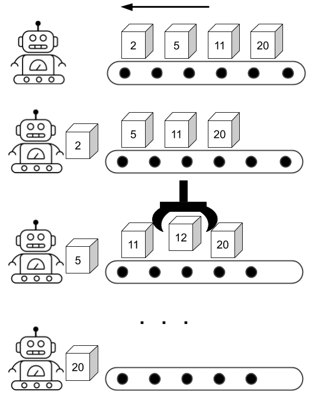

# Chapter 1: Discrete Event Simulation

SeQUeNCe is a quantum network simulator based on discrete event simulation ([DES](https://en.wikipedia.org/wiki/Discrete-event_simulation)). 
DES models systems as a sequence of discrete events. 
In this chapter, we will:

* Introduce the basic concepts if DES (to avoid going through Wikipedia)
* Use the API of the SeQUeNCe kernel to simulate a simple system

## DES Background

The **events** in DES define a change of state of the system. 
The kernel of DES schedules and executes events in the simulated system, ordered by their time of occurrence.
The executed events may generate several new events.

**Note**: executed events cannot generate events before the current (simulation) time.

We use the below figure to show the procedure of DES. The robot in the figure denotes the kernel of DES.
The belt in figure denotes the event list of DES.
The could put several boxes on the belt manually as the initial state. 
The robot will repeatedly processes the nearest box (event). 
While the robot is processing some boxes (e.g box 5), a new box (e.g box 12) may be created and placed at the correct position.
The robot stops work when the belt is empty or a simulation end condition is met. 



## Example: Open and Close Store

### Step 1: Create `Store` Class
Let's use DES to simulate the business hours of a store. First, we create a class for our store:

```python
from sequence.kernel.timeline import Timeline

class Store(object):
    def __init__(self, tl: Timeline):
        self.opening = False
        self.timeline = tl

    def open(self) -> None:
        self.opening = True

    def close(self) -> None:
        self.opening = False
```

The `Store` class has two attributes: `open` and `timeline`. 
`open` denotes the if the store is in its business hours. 
The `timeline` is an instance of a DES kernel.
We will use the `timeline` to bind entities to the DES kernel.

The `Store` class also has two methods: `open` and `close`.
These two functions change the state of the store. 

### Step 2: Schedule Events on `Store`

Let's define a store that opens at 7:00.

```python
from sequence.kernel.event import Event
from sequence.kernel.process import Process

tl = Timeline() # create timeline
tl.show_progress = False # turn of progress bar, we will address this in later tutorials.
store = Store(tl) # create store

# open store at 7:00
open_proc = Process(store, 'open', []) # Process(object, function name: string, arguments of function: List[])
open_event = Event(7, open_proc) # Event(occurring time: int, process: Process)
tl.schedule(open_event) # Timeline.schedule(Event)
```

In the above code, we first create instances of `Timeline` and `Store`. 
Then, we create a process with the object being `Store`, the method of `Store` and a list of arguments for the method.
The `Event` class uses `open_proc` process to create an event occurring at 7:00.
The object `Timeline` then schedules the created event in its event list.

**Question**: after the above code executes, what is the state of `store`?

```python
print(store.opening) # False
```

### Step 3: Run Simulation

You can observe the state of the store is still closed as the simulator has not executed the `open` function yet. 
We just placed the created `event` into the event list.
To run the simulation, we need use `Timeline.run()` to process the scheduled events.

```python
tl.run()
print(tl.now(), store.opening) # 7 True
```

Now, the state of store is updated to the open state. 
Meanwhile, the function `Timeline.now()` presents the current simulation time (7). 
When the simulator executes an event, the simulator will update its time to the timestamp of the event.

**Quiz**: can you change the `store` to close at 19:00?

An example of closing the store is shown below. 

```python
close_proc = Process(store, 'close', [])
close_event = Event(19, close_proc)
tl.schedule(close_event)
tl.run()
print(tl.time, store.opening) # 19 False
```

**Question**: will the state of `store` change if we schedule `close_event` first, then `open_event`?

```python
tl.time = 0
tl.schedule(open_event)
tl.schedule(close_event)
tl.run()
print(tl.time, store.opening)
```

```python
tl.time = 0
tl.schedule(close_event)
tl.schedule(open_event)
tl.run()
print(tl.time, store.opening)
```

You can compare the results of the above programs. 
Both generate the same result (`19 False`), as the order of executing events does not rely on the order of calling the scheduling method. 

## Example: Automatically Open and Close Store 

### Step 1: Upgrade `Store` Class

The previous example allows us to open and close the store manually. 
In this example, we upgrade `Store` to open and close automatically with 12 business hours.
The code of the upgraded `Store` is shown below. 

```python
from sequence.kernel.timeline import Timeline
from sequence.kernel.event import Event
from sequence.kernel.process import Process

class Store(object):
    def __init__(self, tl: Timeline):
        self.opening = False
        self.timeline = tl

    def open(self) -> None:
        self.opening = True
        process = Process(self, 'close', [])
        event = Event(self.timeline.now() + 12, process)
        self.timeline.schedule(event)

    def close(self) -> None:
        self.opening = False
        process = Process(self, 'open', [])
        event = Event(self.timeline.now() + 12, process)
        self.timeline.schedule(event)
```

The updated `Store.open()`(`Store.close()`) function schedules a `Store.close()` (`Store.open()`) after 12 hours.
Now, the `Store` can repeatedly open and close every 12 hours.

### Step 2: Schedule Initial Event

We can then define a store with an initial state - that the store opens at 7. 

```python
tl = Timeline()
tl.show_progress = False
store = Store(tl)
process = Process(store, 'open', [])
event = Event(7, process)
tl.schedule(event)
```

However, if you use `tl.run()` to run the simulation, the simulation will get stuck in an infinite loop. 

### Step 3: Define the Condition of Stopping Simulation and Run Simulation

There are two methods to terminate simulation:

* set the stop time of simulation when creating the `Timeline`
* stop the simulation in a function of `Store`

For the first method, we can construct the object of `Timeline` with the code below:

```python
tl = Timeline(60) # simulate system for 60 hours
```

For the second method, we can call `Timeline.stop()` in the `Store.open()` and `Store.close()` methods:

```python
...
    def open(self) -> None:
        if self.timeline.now() >= 60:
            self.timeline.stop()
        self.opening = True
        process = Process(self, 'close', [])
        event = Event(self.timeline.now() + 12, process)
        self.timeline.schedule(event)
...
    def close(self) -> None:
        if self.timeline.now() >= 60:
            self.timeline.stop()
        self.opening = False
        process = Process(self, 'open', [])
        event = Event(self.timeline.now() + 12, process)
        self.timeline.schedule(event)
...
```

with the above methods, we can observe the state of store after a specfic time.

```python
for t in [15, 32, 52]:
    tl = Timeline(t)
    store = Store(tl)
    print(tl.now())
    
    process = Process(store, 'open', [])
    event = Event(7, process)
    tl.schedule(event)
    
    tl.run()
    print(store.opening)
# True, True, False
```
