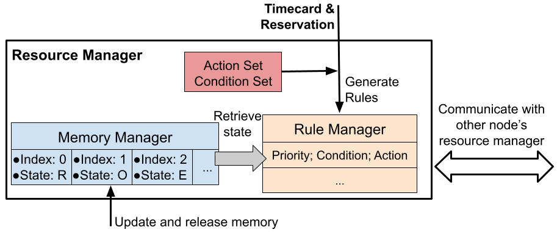

# Chapter 4: Resource Management

In this tutorial, we will show the usual operation of the Resource Management module included in SeQUeNCe. We’re going to build a linear, three-node network and create two entanglement flows. The network, including flows, is shown below:


We'll be using custom rules to create our two flows. Each flow will attempt to entangle 10 pairs, so we will reserve the memories as follows, with green denoting flow 1 and red denoting flow 2:


We will also be creating a custom node class to meet the requirements of this experiment, in a similar manner to past tutorials.

### Background

The Resource Management module in SeQUeNCe is responsible for managing the usage of and flow of information from hardware elements on a node. This is achieved with an internal **memory manager** and **rule manager**, as shown below:



The memory manager is used to track the current state of all quantum memories (including entanglement, fidelity, etc.) while the rule manager uses a set of “rules” (containing a priority, condition to be met, and action to take) to direct local protocols.

### Step 1: Create custom node type

We will first create a custom node type based on the `QuantumRouter` node from SeQUeNCe.
Our node will need to include the memory array hardware and a resource manager, as well as some functions to handle normal operations of the node.
The first function we will need to edit is the `received_message` method, similar to other tutorials.
In this case we will need to add a line to handle messages for the resource manager.
We will also need a method `get_idle_memories`, used by the resource manager to interact with any applications present (see tutorial 6).
In our case, we can leave this method empty.
Finally, we modify the `get` method as in previous tutorials to direct photons from the memory array.

```python
from sequence.topology.node import Node
from sequence.components.memory import MemoryArray
from sequence.resource_management.resource_manager import ResourceManager

class RouterNode(Node):
    def __init__(self, name, tl, memo_size=50):
        super().__init__(name, tl)
        memory_array_name = name + ".MemoryArray"
        memory_array = MemoryArray(memory_array_name, tl, num_memories=memo_size)
        memory_array.add_receiver(self)
        self.add_component(memory_array)

        self.resource_manager = ResourceManager(self, memory_array_name)

    def receive_message(self, src: str, msg: "Message") -> None:
        if msg.receiver == "resource_manager":
            self.resource_manager.received_message(src, msg)
        else:
            if msg.receiver is None:
                matching = [p for p in self.protocols if type(p) == msg.protocol_type]
                for p in matching:
                    p.received_message(src, msg)
            else:
                for protocol in self.protocols:
                    if protocol.name == msg.receiver:
                        protocol.received_message(src, msg)
                        break

    def get_idle_memory(self, info: "MemoryInfo") -> None:
        pass

    def get(self, photon: "Photon", **kwargs):
        dst = kwargs['dst']
        self.send_qubit(dst, photon)
```

### Step 2: Create Rule Conditions for Flow 1

We’re going to focus on custom rules for the short-range entanglement between routers 1 and 2 first. Our first step is
to define the rule conditions for this process that will be used by the resource manager to generate entanglement. In
our case, we will simply use all available memories with the indices `{0 ... 9}` to generate entanglement between the
nodes. We implement a general condition function for choosing `RAW` memories with indices between `index_lower`
and `index_upper`. Our condition is thus relatively simple:

```python
def eg_rule_condition(memory_info: "MemoryInfo", manager: "MemoryManager", args):
    index_upper = args["index_upper"]
    index_lower = args["index_lower"]
    if memory_info.state == "RAW" \
            and index_lower <= memory_info.index <= index_upper:
        return [memory_info]
    else:
        return []
# args = {"index_lower": 0, "index_upper": 9}
```

Rule conditions take 3 arguments:

- `memory_info`, containing the information stored in the memory manager,
- `manager`, which is a reference to the memory manager, and
- `args`, which is a dictionary to store values of other arguments, like `index_upper` and `index_lower`

In our case, we will use any memories in the `RAW` (unentangled) state. Other possible memory states are `OCCUPIED` (for
memories in use by some protocol) and `ENTANGLED` (for memories currently entangled with another, possibly distant,
memory). If our desired condition is met, we will return the `memory_info` as a valid memory. Otherwise, we return
nothing.

The arguments for `args` for flow 1 are shown in the bottom comment.
We will create a variable to store these when we load the rule into the rule manager.

### Step 3: Create Rule Actions for Flow 1

Next, we will dictate what the resource manager should do when our custom condition is met.
This is performed with a rule action.

Rule actions are provided one argument by the resource manager: a list of `memory_info` objects that have met the
condition of the rule. They should return four objects:

1. Any protocols created,
2. A list of nodes of which there are other requirements for operation,
3. Requirements that should be met on other nodes, and
4. Arguments for the requirements function.

In our case, we will create an entanglement generation protocol on both nodes and have router 1 confirm that router 2  has created a protocol.
`eg_rule_action1` will give the action for router 1 (including sending a requirement to router  2), and `eg_rule_action2` will give the action for router 2.
The action on router 1 will create the `EntanglementGenerationA` protocol and request the corresponding protocol from router 2 by sending the function `eg_req_func` and its arguments `req_args`.
The `req_args` contain constraints about the target protocol.
In this example, we use the type of protocol and memory index to filter the proper protocol.
The action on router 2 will create an `EntanglementGenerationA` protocol and wait for a request from router 1.
The `mid_name` and `other_name` in `args` define the name of BSM node and the other router used for generating entanglement.
Note that the name of router 1 will be `“r1”`, the name of router 2 will be `“r2”`, and the name of the intermediate measurement node (see tutorial 3 for details) will be `“m12”`, which will be set when loading rules.

```python
from sequence.entanglement_management.generation import EntanglementGenerationA

def eg_req_func(protocols, args):
    remote_node = args["remote_node"]
    index_upper = args["index_upper"]
    index_lower = args["index_lower"]

    for protocol in protocols:
        if not isinstance(protocol, EntanglementGenerationA):
            continue
        mem_arr = protocol.own.get_components_by_type("MemoryArray")[0]
        if protocol.remote_node_name == remote_node and \
                index_lower <= mem_arr.memories.index(protocol.memory) <= index_upper:
            return protocol


def eg_rule_action1(memories_info: List["MemoryInfo"], args):
    mid_name = args["mid_name"]
    other_name = args["other_name"]

    memories = [info.memory for info in memories_info]
    memory = memories[0]
    protocol = EntanglementGenerationA(None, "EGA." + memory.name, mid_name,
                                       other_name,
                                       memory)
    req_args = {"remote_node": args["node_name"],
                "index_upper": args["index_upper"],
                "index_lower": args["index_lower"]}
    return [protocol, [other_name], [eg_req_func], [req_args]]


def eg_rule_action2(memories_info: List["MemoryInfo"], args):
    mid_name = args["mid_name"]
    other_name = args["other_name"]
    memories = [info.memory for info in memories_info]
    memory = memories[0]
    protocol = EntanglementGenerationA(None, "EGA." + memory.name,
                                       mid_name, other_name, memory)
    return [protocol, [None], [None], [None]]
```

### Step 4: Build the Network

We’ll now actually build our network and get ready to run the simulation.
We will include the third router node, as this will be used for our second flow, but we will not use it in our first experiment:

```python
from sequence.kernel.timeline import Timeline
from sequence.topology.node import BSMNode
from sequence.components.optical_channel import ClassicalChannel, QuantumChannel

runtime = 10e12
tl = Timeline(runtime)

# nodes
r1 = RouterNode("r1", tl, memo_size=20)
r2 = RouterNode("r2", tl, memo_size=40)
r3 = RouterNode("r3", tl, memo_size=10)

m12 = BSMNode("m12", tl, ["r1", "r2"])
m23 = BSMNode("m23", tl, ["r2", "r3"])

node_list = [r1, r2, r3, m12, m23]
for i, node in enumerate(node_list):
    node.set_seed(i)

# create all-to-all classical connections
cc_delay = 1e9
for node1 in node_list:
    for node2 in node_list:
        cc = ClassicalChannel("cc_%s_%s" % (node1.name, node2.name), tl, 1e3, delay=cc_delay)
        cc.set_ends(node1, node2.name)

# create quantum channels linking r1 and r2 to m1
qc_atten = 0
qc_dist = 1e3
qc1 = QuantumChannel("qc_r1_m12", tl, qc_atten, qc_dist)
qc1.set_ends(r1, m12.name)
qc2 = QuantumChannel("qc_r2_m12", tl, qc_atten, qc_dist)
qc2.set_ends(r2, m12.name)
# create quantum channels linking r2 and r3 to m2
qc3 = QuantumChannel("qc_r2_m23", tl, qc_atten, qc_dist)
qc3.set_ends(r2, m23.name)
qc4 = QuantumChannel("qc_r3_m23", tl, qc_atten, qc_dist)
qc4.set_ends(r3, m23.name)
```

### Step 5: Run the Simulation with 1 Flow

Finally, we can run our initial simulation, including installation of our custom rules. We will start our entanglement
flow at the beginning of the simulation by installing the rules. Rules are created with a priority, rule action, rule
condition, and arguments of action and condition, while rules are installed with the `load` method of the resource
manager. For flow 1, routers `r1` and `r2` will use BSM node `m12` and memories with indicies between 0 and 9 to
generate entanglement. These are specified in the action and condition args.

```python
from sequence.resource_management.rule_manager import Rule

tl.init()

# load rules
action_args = {"mid_name": "m12", "other_name": "r2", "node_name": "r1",
               "index_upper": 9, "index_lower": 0}
condition_args = {"index_lower": 0, "index_upper": 9}
rule1 = Rule(10, eg_rule_action1, eg_rule_condition, action_args, condition_args)
r1.resource_manager.load(rule1)
action_args2 = {"mid_name": "m12", "other_name": "r1"}
rule2 = Rule(10, eg_rule_action2, eg_rule_condition, action_args2, condition_args)
r2.resource_manager.load(rule2)

tl.run()

print("Router 1 Memories")
print("Index:\tEntangled Node:\tFidelity:\tEntanglement Time:")
for i, info in enumerate(r1.resource_manager.memory_manager):
    print("{:6}\t{:15}\t{:9}\t{}".format(str(i), str(info.remote_node),
                                         str(info.fidelity), str(info.entangle_time * 1e-12)))
```

At the end of our simulation, we will print out for each memory (on router 1):
- The memory index,
- The node to which the memory is entangled,
- The fidelity of entanglement, and
- The time at which it was entangled.

We should notice that all of the memories 0-9 are entangled with router 2 within a short time.

### Step 6: Flow 2 Entanglement Generation

Now, we'll create the custom rules to control our second flow between routers 1 and 3.
The first step is again to set up entanglement generation in a similar manner to the first flow.
To do this, we'll create a function `add_eg_rules` that takes as arguments
- `index`, the index of the router (in the path) we will be adding rules to,
- `path`, a list of router nodes that make up the path of the entanglement flow, and
- `middles`, a list of bsm nodes along the path.

The conditions and actions of the rule will be very similar to before, but with variable memory indices, nodes, and
arguments.

```python
def add_eg_rules(index: int, path: List[RouterNode], middles: List[BSMNode]):
    assert len(path) == len(middles) + 1
    node_names = [node.name for node in path]
    middle_names = [node.name for node in middles]
    node_mems = [[10, 20], [10, 30], [0, 10]]

    node = path[index]
    mem_range = node_mems[index]

    if index > 0:
        action_args = {"mid_name": middle_names[index - 1],
                       "other_name": node_names[index - 1]}
        condition_args = {"index_lower": mem_range[0],
                          "index_upper": mem_range[0] + 9}

        rule = Rule(10, eg_rule_action2, eg_rule_condition, action_args,
                    condition_args)
        node.resource_manager.load(rule)

    if index < (len(path) - 1):
        if index == 0:
            condition_args = {"index_lower": mem_range[0],
                              "index_upper": mem_range[1] - 1}
        else:
            condition_args = {"index_lower": mem_range[1] - 10,
                              "index_upper": mem_range[1] - 1}

        action_args = {"mid_name": middle_names[index],
                       "other_name": node_names[index + 1],
                       "node_name": node.name,
                       "index_upper": node_mems[index + 1][1] - 1,
                       "index_lower": node_mems[index + 1][0]}

        memories = [info.memory for info in memories_info]
        memory = memories[0]
        protocol = EntanglementGenerationA(None, "EGA." + memory.name, middle_names[index], node_names[index + 1],
                                           memory)
        return [protocol, [node_names[index + 1]], [req_func]]

    rule = Rule(10, eg_rule_action, eg_rule_condition)
    node.resource_manager.load(rule)
```

### Step 7: Flow 2 Entanglement Purification

We'll next create rules for entanglement purification. Our rule conditions will be a little different,
as we will want memories to be in the `ENTANGLED` state with fidelity below some threshold (that we wish to improve).
Each protocol will also need two memories, one of which will be consumed while the fidelity of the other increases.
The arguments for our `add_ep_rules` function will be similar to our previous function:
- `index`, the index of the router (in the path) we will be adding rules to,
- `path`, a list of router nodes that make up the path of the entanglement flow, and
- `target_fidelity`, the fidelity of entanglement we wish to achieve.

```python
from sequence.entanglement_management.purification import BBPSSW

def ep_rule_condition1(memory_info: "MemoryInfo", manager: "MemoryManager",
                       args):
    index_upper = args["index_upper"]
    index_lower = args["index_lower"]
    target_fidelity = args["target_fidelity"]
    if (index_lower <= memory_info.index <= index_upper
            and memory_info.state == "ENTANGLED"
            and memory_info.fidelity < target_fidelity):
        for info in manager:
            if (info != memory_info
                    and index_lower <= info.index <= index_upper
                    and info.state == "ENTANGLED"
                    and info.remote_node == memory_info.remote_node
                    and info.fidelity == memory_info.fidelity):
                assert memory_info.remote_memo != info.remote_memo
                return [memory_info, info]
    return []

def ep_req_func(protocols, args):
    remote1 = args["remote1"]
    remote2 = args["remote2"]

    _protocols = []
    for protocol in protocols:
        if not isinstance(protocol, BBPSSW):
            continue

        if protocol.kept_memo.name == remote1:
            _protocols.insert(0, protocol)
        if protocol.kept_memo.name == remote2:
            _protocols.insert(1, protocol)

    if len(_protocols) != 2:
        return None

    protocols.remove(_protocols[1])
    _protocols[1].rule.protocols.remove(_protocols[1])
    _protocols[1].kept_memo.detach(_protocols[1])
    _protocols[0].meas_memo = _protocols[1].kept_memo
    _protocols[0].memories = [_protocols[0].kept_memo,
                              _protocols[0].meas_memo]
    _protocols[0].name = _protocols[0].name + "." + _protocols[
        0].meas_memo.name
    _protocols[0].meas_memo.attach(_protocols[0])

    return _protocols[0]


def ep_rule_action1(memories_info: List["MemoryInfo"], args):
    memories = [info.memory for info in memories_info]
    name = "EP.%s.%s" % (memories[0].name, memories[1].name)
    protocol = BBPSSW(None, name, memories[0], memories[1])
    dsts = [memories_info[0].remote_node]
    req_funcs = [ep_req_func]
    req_args = {"remote1": memories_info[0].remote_memo,
                "remote2": memories_info[1].remote_memo}
    return [protocol, dsts, req_funcs, [req_args]]


def ep_rule_condition2(memory_info: "MemoryInfo", manager: "MemoryManager",
                       args):
    index_upper = args["index_upper"]
    index_lower = args["index_lower"]
    target_fidelity = args["target_fidelity"]
    if (index_lower <= memory_info.index <= index_upper
            and memory_info.state == "ENTANGLED"
            and memory_info.fidelity < target_fidelity):
        return [memory_info]
    return []

        def ep_rule_action(memories_info: List["MemoryInfo"]):
            memories = [info.memory for info in memories_info]
            name = "EP.%s" % (memories[0].name)
            protocol = BBPSSW(None, name, memories[0], None)
            return protocol, [None], [None]

        rule = Rule(10, ep_rule_action, ep_rule_condition)
        node.resource_manager.load(rule)


def add_ep_rules(index: int, path: List[RouterNode], target_fidelity: float):
    node_mems = [[10, 20], [10, 30], [0, 10]]

    node = path[index]
    mem_range = node_mems[index]

    if index > 0:
        condition_args = {"index_lower": mem_range[0],
                          "index_upper": mem_range[1] - 1,
                          "target_fidelity": target_fidelity}

        rule = Rule(10, ep_rule_action1, ep_rule_condition1, {}, condition_args)
        node.resource_manager.load(rule)

    if index < len(path) - 1:
        if index == 0:
            condition_args = {"index_lower": mem_range[0],
                              "index_upper": mem_range[1] - 1,
                              "target_fidelity": target_fidelity}
        else:
            condition_args = {"index_lower": mem_range[1] - 10,
                              "index_upper": mem_range[1] - 1,
                              "target_fidelity": target_fidelity}

        rule = Rule(10, ep_rule_action2, ep_rule_condition2, {}, condition_args)
        node.resource_manager.load(rule)
```

### Step 8: Flow 2 Entanglement Swapping
Finally, we'll generate rules for entanglement swapping.
The rules will be a little more complicated as we require different protocols for the intermediate and end routers (see tutorial 3).
However, the basic principles of rule creation remain the same, requiring a condition, an action, and args.
Our condition will be that we have memory pairs in the `ENTANGLED` state between the intermediate and each end router, and that the fidelity of the memory state is above some threshold.
For now, we will only define the actions and conditions and leave the rule creation for the script.

```python
from sequence.entanglement_management.swapping import EntanglementSwappingA, EntanglementSwappingB

def es_rule_conditionA(memory_info: "MemoryInfo", manager: "MemoryManager",
                       args):
    index_lower = args["index_lower"]
    index_upper = args["index_upper"]
    target_fidelity = args["target_fidelity"]
    left, right = args["left"], args["right"]

    if (memory_info.state == "ENTANGLED"
            and memory_info.index in range(index_lower, index_upper)
            and memory_info.remote_node == left
            and memory_info.fidelity >= target_fidelity):
        for info in manager:
            if (info.state == "ENTANGLED"
                    and info.index in range(index_lower, index_upper)
                    and info.remote_node == right
                    and info.fidelity >= target_fidelity):
                return [memory_info, info]
    elif (memory_info.state == "ENTANGLED"
          and memory_info.index in range(index_lower, index_upper)
          and memory_info.remote_node == right
          and memory_info.fidelity >= target_fidelity):
        for info in manager:
            if (info.state == "ENTANGLED"
                    and info.index in range(index_lower, index_upper)
                    and info.remote_node == left
                    and info.fidelity >= target_fidelity):
                return [memory_info, info]
    return []


def es_req_func(protocols, args):
    target_memo = args["target_memo"]
    for protocol in protocols:
        if (isinstance(protocol, EntanglementSwappingB)
                and protocol.memory.name == target_memo):
            return protocol


def es_rule_actionA(memories_info: List["MemoryInfo"], args):
    succ_prob = args["succ_prob"]
    degradation = args["degradation"]

    memories = [info.memory for info in memories_info]

    protocol = EntanglementSwappingA(None, "ESA.%s.%s" % (
        memories[0].name, memories[1].name),
                                     memories[0], memories[1],
                                     success_prob=succ_prob,
                                     degradation=degradation)
    dsts = [info.remote_node for info in memories_info]
    req_funcs = [es_req_func, es_req_func]
    req_args = [{"target_memo": memories_info[0].remote_memo},
                {"target_memo": memories_info[1].remote_memo}]
    return [protocol, dsts, req_funcs, req_args]


def es_rule_conditionB(memory_info: "MemoryInfo", manager: "MemoryManager",
                       args):
    index_lower = args["index_lower"]
    index_upper = args["index_upper"]
    target_node = args["target_node"]
    target_fidelity = args["target_fidelity"]

    if (memory_info.state == "ENTANGLED"
            and memory_info.index in range(index_lower, index_upper)
            and memory_info.remote_node != target_node
            and memory_info.fidelity >= target_fidelity):
        return [memory_info]
    else:
        return []


def es_rule_actionB(memories_info: List["MemoryInfo"], args):
    memories = [info.memory for info in memories_info]
    memory = memories[0]
    protocol = EntanglementSwappingB(None, "ESB." + memory.name, memory)
    return [protocol, [None], [None], [None]]
```

### Step 9: Run the Simulation Again

We will now run the simulation again, adding in our new custom rules for the second flow. We will also add code to display memory information on routers 2 and 3. We should observe long-distance entanglement between routers 1 and 3 alongside the short distance entanglement from our first experiment.

```python
tl.init()

# load rules for flow 1
action_args = {"mid_name": "m12", "other_name": "r2", "node_name": "r1",
               "index_upper": 9, "index_lower": 0}
condition_args = {"index_lower": 0, "index_upper": 9}
rule1 = Rule(10, eg_rule_action1, eg_rule_condition, action_args, condition_args)
r1.resource_manager.load(rule1)
action_args2 = {"mid_name": "m12", "other_name": "r1"}
rule2 = Rule(10, eg_rule_action2, eg_rule_condition, action_args2, condition_args)
r2.resource_manager.load(rule2)

# load rules for flow 2
for i in range(3):
    add_eg_rules(i, [r1, r2, r3], [m12, m23])
    add_ep_rules(i, [r1, r2, r3], 0.9)

condition_args = {"index_lower": 10,
                  "index_upper": 20,
                  "target_node": r3.name,
                  "target_fidelity": 0.9}
rule = Rule(10, es_rule_actionB, es_rule_conditionB, {}, condition_args)
r1.resource_manager.load(rule)

condition_args = {"index_lower": 0,
                  "index_upper": 10,
                  "target_node": r1.name,
                  "target_fidelity": 0.9}
rule = Rule(10, es_rule_actionB, es_rule_conditionB, {}, condition_args)
r3.resource_manager.load(rule)

action_args = {"succ_prob": 1, "degradation": 1}
condition_args = {"index_lower": 10,
                  "index_upper": 30,
                  "target_fidelity": 0.9,
                  "left": r1.name, "right": r3.name}
rule = Rule(10, es_rule_actionA, es_rule_conditionA, action_args, condition_args)
r2.resource_manager.load(rule)

tl.run()

print("Router 1 Memories")
print("Index:\tEntangled Node:\tFidelity:\tEntanglement Time:")
for i, info in enumerate(r1.resource_manager.memory_manager):
    print("{:6}\t{:15}\t{:9}\t{}".format(str(i), str(info.remote_node),
                                         str(info.fidelity), str(info.entangle_time * 1e-12)))

print("Router 2 Memories")
print("Index:\tEntangled Node:\tFidelity:\tEntanglement Time:")
for i, info in enumerate(r2.resource_manager.memory_manager):
    print("{:6}\t{:15}\t{:9}\t{}".format(str(i), str(info.remote_node),
                                         str(info.fidelity), str(info.entangle_time * 1e-12)))

print("Router 3 Memories")
print("Index:\tEntangled Node:\tFidelity:\tEntanglement Time:")
for i, info in enumerate(r3.resource_manager.memory_manager):
    print("{:6}\t{:15}\t{:9}\t{}".format(str(i), str(info.remote_node),
                                         str(info.fidelity), str(info.entangle_time * 1e-12)))
```
